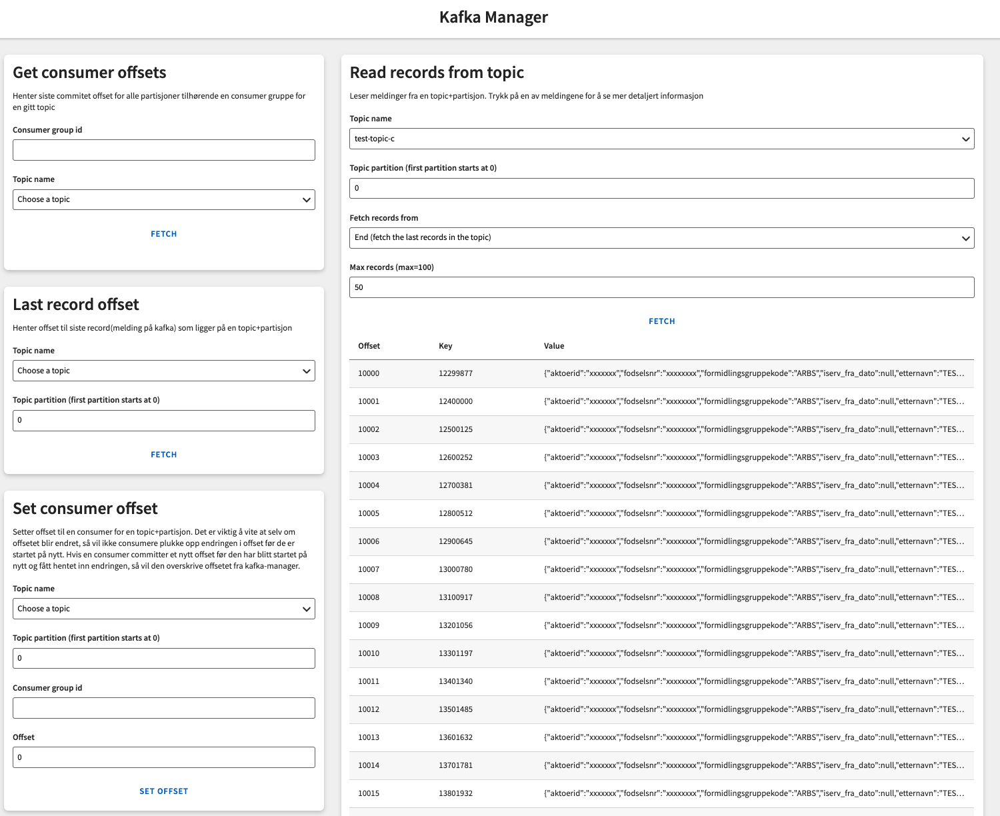
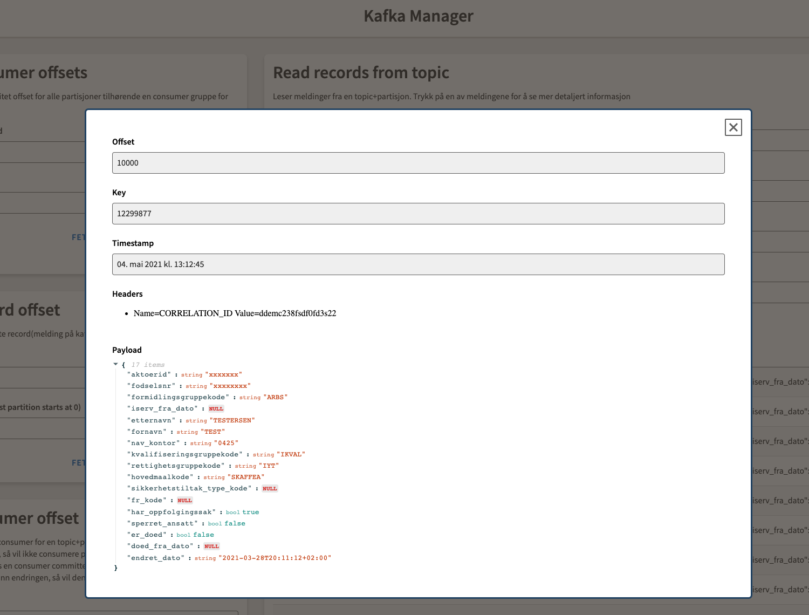

# Kafka manager

Applikasjon for håndtering av Kafka topics.

Kan f.eks brukes for å hente ut meldinger, offsets på consumer, offsets på siste melding eller sette consumer offsets.

Appen støtter både on-prem og Aiven Kafka og visning av de aller fleste typer meldinger.

## Screenshots





## Hvordan sette opp

Hvert team som ønsker å bruke Kafka Manager må deploye sin egen instanse i eget team namespace.

Dette kan f.eks gjøres ved å bruke `kubectl apply -f <team>-kafka-manager.yaml`.
YAML-filen burde fulge malen nedenfor.

```yaml
kind: Application
apiVersion: nais.io/v1alpha1
metadata:
  name: <team>-kafka-manager
  namespace: <team>
  labels:
    team: <team>
spec:
  image: docker.pkg.github.com/navikt/kafka-manager/kafka-manager:<version> # See https://github.com/navikt/kafka-manager/packages
  port: 8080
  webproxy: true
  ingresses:
    - https://<team>-kafka-manager(.dev).intern.nav.no
  prometheus:
    enabled: true
    path: /internal/prometheus
  readiness:
    path: /internal/health/readiness
    initialDelay: 20
  liveness:
    path: /internal/health/liveness
    initialDelay: 20
  replicas:
    min: 1
    max: 1  # 1 instance is required since in-memory session management is used
    cpuThresholdPercentage: 75
  resources:
    limits:
      cpu: "1"
      memory: 1024Mi
    requests:
      cpu: 250m
      memory: 512Mi
  # Optional. Vault section is required for on-prem (the env variables SERVICE_USER_NAME, SERVICE_USER_PASSWORD can also be used)
  vault:
    enabled: true
    paths:
      - kvPath: /serviceuser/data/<dev|prod>/srv<team>-kafka-manager
        mountPath: /var/run/secrets/nais.io/service_user
  azure:
    application:
      enabled: true
      tenant: nav.no
      claims:
        groups:
          - id: <Azure AD group>
  kafka:
    pool: nav-<dev|prod>
  env:
    # Optional. Required for on-prem
    - name: ON_PREM_KAFKA_BROKERS_URL
      value: <BROKER URL>
    # Optional. Required for on-prem topics that uses Avro
    - name: ON_PREM_SCHEMA_REGISTRY_URL
      value: <SCHEMA REGISTRY URL>
    # Required
    - name: APP_CONFIG_JSON
      value: >
          {
            "topics": [
              {
                "name": "topic-a",
                "location": "ON_PREM",
                "keyDeserializerType": "STRING",
                "valueDeserializerType": "STRING"
              },
              {
                "name": "<some team>.topic-b",
                "location": "AIVEN",
                "keyDeserializerType": "STRING",
                "valueDeserializerType": "STRING"
              },
              {
                "name": "topic-c",
                "location": "ON_PREM",
                "keyDeserializerType": "LONG",
                "valueDeserializerType": "AVRO"
              }
            ]
          }
```

### Autorisering
Pr nå så er autoriseringen gjort ved bruke av `spec.azure.application.claims.groups`.
Dvs at det viktig å spesifisere IDen til en gruppe i Azure AD på hvilke brukere som skal få tilgang til appen.

Se: https://doc.nais.io/security/auth/azure-ad/#groups

### Deserialisering

Følgende typer verdier er støttet i `keyDeserializerType` og `valueDeserializerType`:
```
    STRING,
    DOUBLE,
    FLOAT,
    INTEGER,
    LONG,
    SHORT,
    UUID,
    AVRO
```

### Tilgang til topics

Det er viktig at applikasjonen har tilgang til topicene som er beskrevet i **APP_CONFIG_JSON**.

Applikasjonen/systembrukeren må bli lagt til som consumer for at kafka-manager skal få tilgang.

For on-prem så kan man legge til en ny systembruker med oneshot endepunktet, som f.eks:
```json
"members": [
    {
      "member": "srv<team>-kafka-manager",
      "role": "CONSUMER"
    }
]
```

For Aiven så kan man legge til en ny applikasjon med Topic-ressursen, f.eks:
```yaml
spec:
  acl:
    - team: pto
      application: <team>-kafka-manager
      access: read
```

## NB

Det er viktig at teamet selv gjør en avklaring på hvilke topics som er greit å eksponere i GUIet, og hvem som skal ha tilgang til dem.

## Disclaimer

Denne appen ble utviklet som en POC så det er mye som potensielt kan forbedres, både i kode og funksjonelt.
Bruk på eget ansvar ;)
